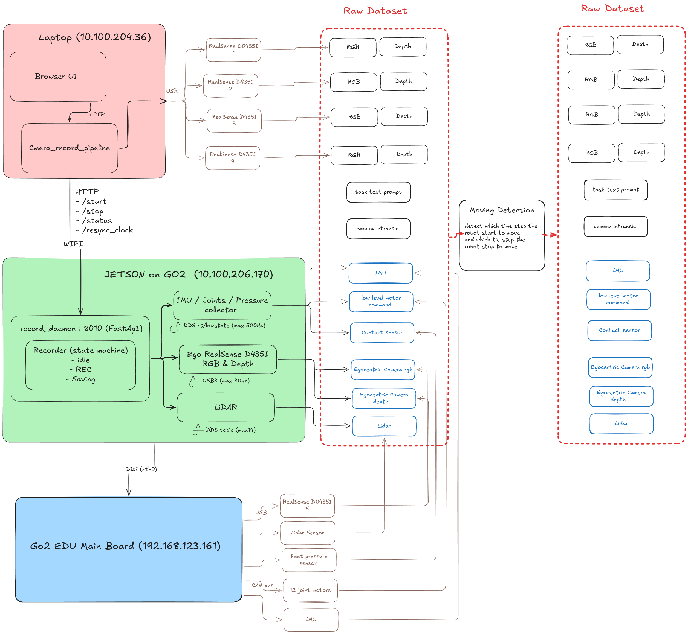
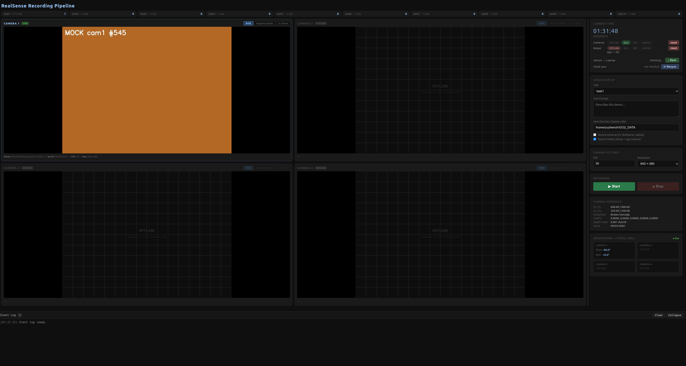

# REAL_GO2_HUB

Landing page for our synchronized data collection stack on the
**Unitree Go2 EDU** quadruped. The actual code lives in two separate
repositories — this repo is just a navigation entry point.



**At a glance:** the Laptop runs `camera_record_pipeline` (4× third-person
RealSense D435I + browser UI). The Jetson on the robot runs
`record_daemon`, which collects IMU / joint / contact data from the Go2
main board (via DDS), plus ego-view RGB-D and LiDAR. Both halves share
one Unix-epoch timeline (chrony-synced), write to their own disks
during recording, and merge via `rsync` afterwards.

---

## Example recording

Five RGB streams from one session (`task1`, 04/18/2026 19:56:52) — four
third-person D435Is on top and the ego view on the bottom, composited
into one video so they play in sync.

<video src="https://github.com/user-attachments/assets/c783f85d-6fb3-4a91-a616-83a45719920a"
       autoplay muted loop playsinline width="100%"></video>

---

## Repositories

### 📹 [camera_record_pipeline](https://github.com/yuzhench/Harvard_AI_Robotics_cameras_recording_system)
Laptop-side server. 4× Intel RealSense D435I cameras (third-person view),
FastAPI backend, browser-based live preview + recording UI, WebGL point
cloud viewer. Can run stand-alone as a 4-camera recorder, or paired with
the robot repo below for full multi-modal capture.

### 🤖 [go2_record_pipeline](https://github.com/yuzhench/Harvard_AI_Robotics_go2_recording_system)
Robot-side daemon. Runs on the on-board Jetson and streams IMU, joint
states, foot contact forces, ego RGB-D, and LiDAR point clouds. Controlled
remotely via HTTP from the laptop UI.

---

## How they fit together

- **Control plane**: the laptop UI sends HTTP `/start` and `/stop` to
  both the local camera backend and the Jetson daemon in parallel.
- **Data plane**: each machine writes to its own local disk. Nothing
  large ever crosses the network during recording.
- **Time alignment**: both hosts run `chrony`; the Jetson syncs to the
  laptop(s) with sub-millisecond offset. All timestamps are
  `time.time()` → same Unix epoch.
- **Merging**: after recording, `rsync` pulls Jetson data into a
  matching session folder on the laptop. Downstream scripts see one
  directory tree containing both `first_person/` (from Jetson) and
  `third_person/` (from laptop).

Full architecture diagrams, time-sync setup, and network topology live
in **[go2_record_pipeline/GO_NOTES/control_architecture.md](https://github.com/yuzhench/Harvard_AI_Robotics_go2_recording_system/blob/main/GO_NOTES/control_architecture.md)**.

---

## Quick deployment

```bash
# Laptop side
git clone https://github.com/yuzhench/Harvard_AI_Robotics_cameras_recording_system.git
cd Harvard_AI_Robotics_cameras_recording_system && ./run.sh      # open http://localhost:8000

# Jetson side
git clone https://github.com/yuzhench/Harvard_AI_Robotics_go2_recording_system.git
rsync -avz Harvard_AI_Robotics_go2_recording_system/ unitree@<jetson_ip>:~/Desktop/go2_record_pipeline/
ssh unitree@<jetson_ip> "sudo systemctl restart record_daemon"
```

Point the laptop at the Jetson with `JETSON_URL=http://<jetson_ip>:8010`
and the UI's Start/Stop buttons will fan out to both sides.

---

## Web interface

Once the laptop backend is running, open `http://localhost:8000` in a browser.



### What you see on the page

**Left pane — live camera grid (2×2)**
Up to 4 RealSense panels. Each panel shows a `LIVE` / `OFFLINE` badge,
buttons to toggle between RGB and aligned-depth view, and a `⊙ Cloud`
button that opens the interactive 3D point cloud viewer. The screenshot
above shows mock mode, with CAMERA 1 producing a synthetic frame and
the other three panels offline.

**Top — stats bar**
One chip per task (`task1` … `task10`), each showing demo count and
average duration. Click a chip to select that task in the session setup.

**Right pane — control cards (top to bottom)**

| Card | What it does |
|---|---|
| **Current Time** (big digital clock) | Wall-clock time + session state (CAMERAS IDLE / RECORDING, ROBOT OFFLINE / IDLE / RECORDING), elapsed timer while recording |
| **Jetson → Laptop** | Data-sync status + `↓ Sync` button (rsync pull from Jetson) |
| **Clock sync** | Last measured offset + `⟳ Resync` button (triggers `chrony` restart on Jetson) |
| **Session Setup** | Task dropdown, text-prompt field (required), save-directory path |
| **Camera Settings** | FPS and resolution selectors |
| **▶ Start / ■ Stop** | Begin / end a recording session |
| **Camera Intrinsics** | fx / fy / cx / cy, distortion model, serial number of the first active camera |
| **Orientation — Pitch / Roll** | Real-time D435I IMU orientation, updated at 2 Hz |

**Bottom — Event Log (collapsible)**
Persistent footer panel. Every toast message (successes, warnings,
errors) is also appended here with a timestamp and color code. Survives
long after the transient toast fades, so you can scroll back through
the session. Not persisted across page reloads.

### How to record a session

1. **Start both backends** (camera_record_pipeline on the laptop,
   record_daemon on the Jetson). Confirm the right pane's CAMERAS and
   ROBOT both show IDLE (not OFFLINE).
2. **Sync the clock** — click `⟳ Resync`. Should finish in a few seconds
   and display something like `+0.12 ms · g14.partners.org`.
3. **Pick a task** from the dropdown; type a brief text prompt describing
   what the robot is about to do (required — Start button is disabled
   without it).
4. **Click ▶ Start**. All cameras and all Jetson collectors begin recording
   simultaneously. The status turns red "RECORDING" and the elapsed
   counter starts.
5. **Perform the demo** — teleoperate the robot, move objects, etc.
6. **Click ■ Stop**. Cameras and the Jetson daemon both flush to disk in
   parallel. The UI transitions through "SAVING" (depth `.npz`
   compression and LiDAR `.npy` take up to ~30 s) → "IDLE". Stats bar
   at the top updates.
7. **(Later) Pull Jetson data** back to the laptop — see the data-sync
   note below.

### ⟳ Clock sync — once per day is enough

chrony continuously maintains sub-millisecond alignment in the background,
so you do **not** need to click Resync before every recording. **Once at
the start of each work day is sufficient.** The button just triggers a
fresh restart-to-resync on the Jetson as a belt-and-braces check after
the robot has been powered off / moved / re-joined WiFi.

### ↓ Sync data — prefer a USB cable when the dataset is large

The `↓ Sync` button runs `rsync` over SSH (WiFi). This works but **is not
very stable** — WiFi jitter and bandwidth saturation occasionally break
the transfer mid-stream, especially for multi-GB sessions. For anything
serious:

> **Recommended**: plug a USB-C cable directly into the Jetson, `scp` /
> `rsync` over the wired link, or pop the SD card / NVMe and copy files
> locally. Wired transfer is ~10× faster and doesn't share the robot's
> WiFi link.

Use the UI's `↓ Sync` button only for quick pulls of small sessions
(under a few hundred MB) or for checking "what's pending on the Jetson"
via its status display.

---

## Data output

```
<DATA_ROOT>/<task>/<MM_DD_YYYY>/<HH_MM_SS>/
├── first_person/     ← go2_record_pipeline (Jetson)
│   ├── imu.npz  joints.npz  contacts.npz
│   ├── ego_cam/{rgb.mp4, rgb_timestamps.npy, depth.npz, intrinsics.json}
│   └── lidar/...
└── third_person/     ← camera_record_pipeline (laptop)
    └── cam{0..3}/{rgb.mp4, rgb_timestamps.npy, depth.npz, intrinsics.json}
```

Every `.npy` timestamp in either half is on the same Unix-epoch
timeline — align by interpolation, no calibration constants needed.

---

## Requirements

| | |
|---|---|
| **Robot** | Unitree Go2 EDU (EDU variant required for SDK access) |
| **On-robot compute** | Jetson Orin NX (Go2's factory board) |
| **Laptop** | Linux (Ubuntu 20.04+), USB 3.x ports |
| **Cameras** | Intel RealSense D435I × 1–4 |
| **Network** | Laptop and Jetson on the same LAN (`/22` subnet fine) |

---

## Further reading

- [Architecture diagrams (§20)](https://github.com/yuzhench/Harvard_AI_Robotics_go2_recording_system/blob/main/GO_NOTES/control_architecture.md#20-全局示意图用于-slide--report)
- [Time synchronization setup (§19)](https://github.com/yuzhench/Harvard_AI_Robotics_go2_recording_system/blob/main/GO_NOTES/control_architecture.md#19-时间同步chrony)
- [Network topology (§16)](https://github.com/yuzhench/Harvard_AI_Robotics_go2_recording_system/blob/main/GO_NOTES/control_architecture.md#16-笔记本与-jetson-通过-phswifi3-互通)
